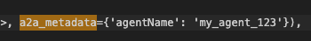

# manual-A2A-request-metadata-propagation-to-InvocationContext
manual A2A request metadata propagation to InvocationContext

# Manual e2e test

Install dependencies
`uv pip install -r pyproject.toml`

Install custom wheel with changes
`uv pip install ./dist/google_adk-1.15.1-py3-none-any.whl`

Start up the a2a server using
`uvicorn multi_tool_agent.agent:a2a_app --host localhost --port 8001 --log-level debug`

Send a manual curl request
```bash
curl -X POST -H "Content-Type: application/json" \
-d '{
    "id": "abc123",
    "jsonrpc": "2.0",
    "method": "message/send",
    "params": {
        "message": 
            {
                "messageId": "msg1",
                "kind": "message",
                "role": "user",
                "parts": [
                    {
                        "text": "Hi, what can you help me with?"
                    }
                ]
                
            }
        ,
        "metadata": {
            "agentName": "my_agent_123"
        }
    }
}' http://127.0.0.1:8001/
```

Review log.txt file created to confirm that the a2a metadata element is present (Search for keywords "a2a_metadata")

